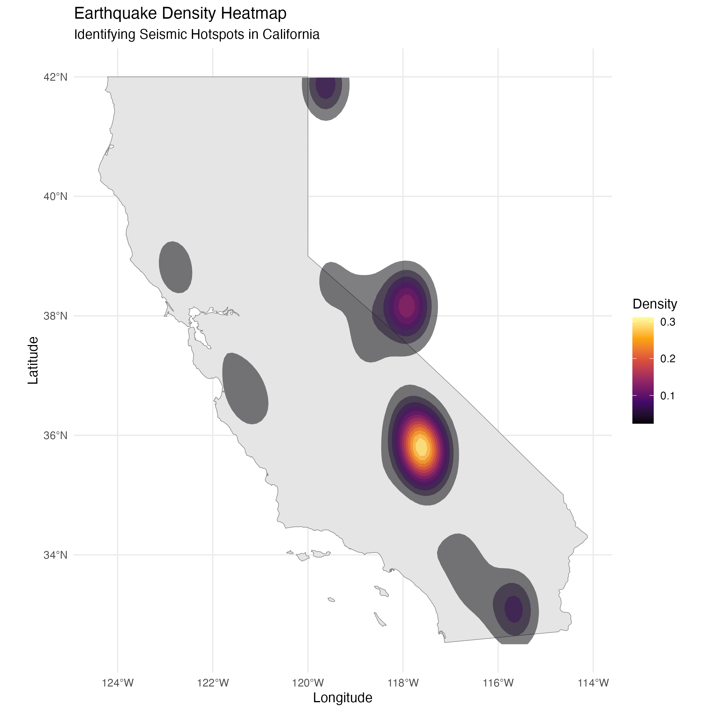
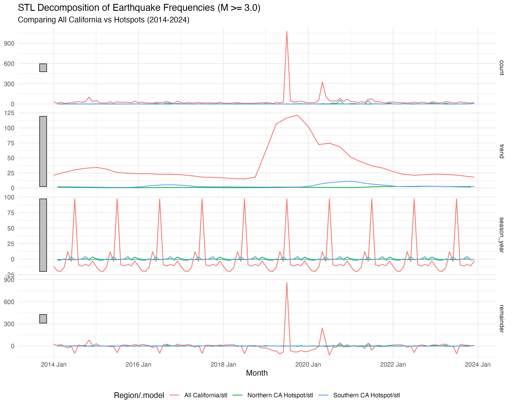
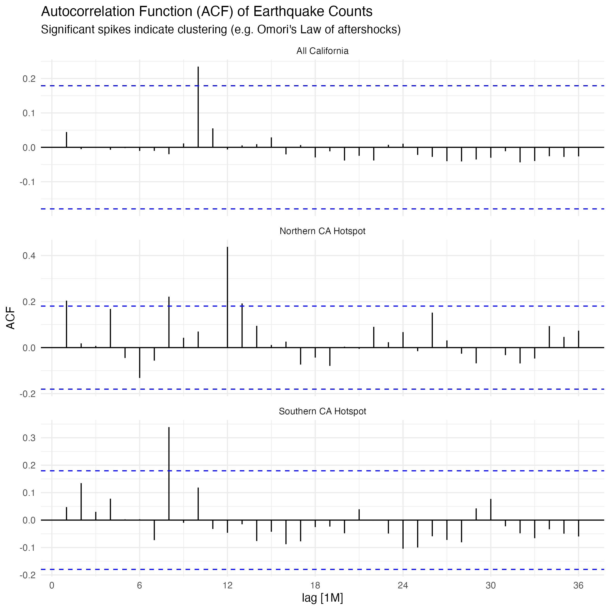
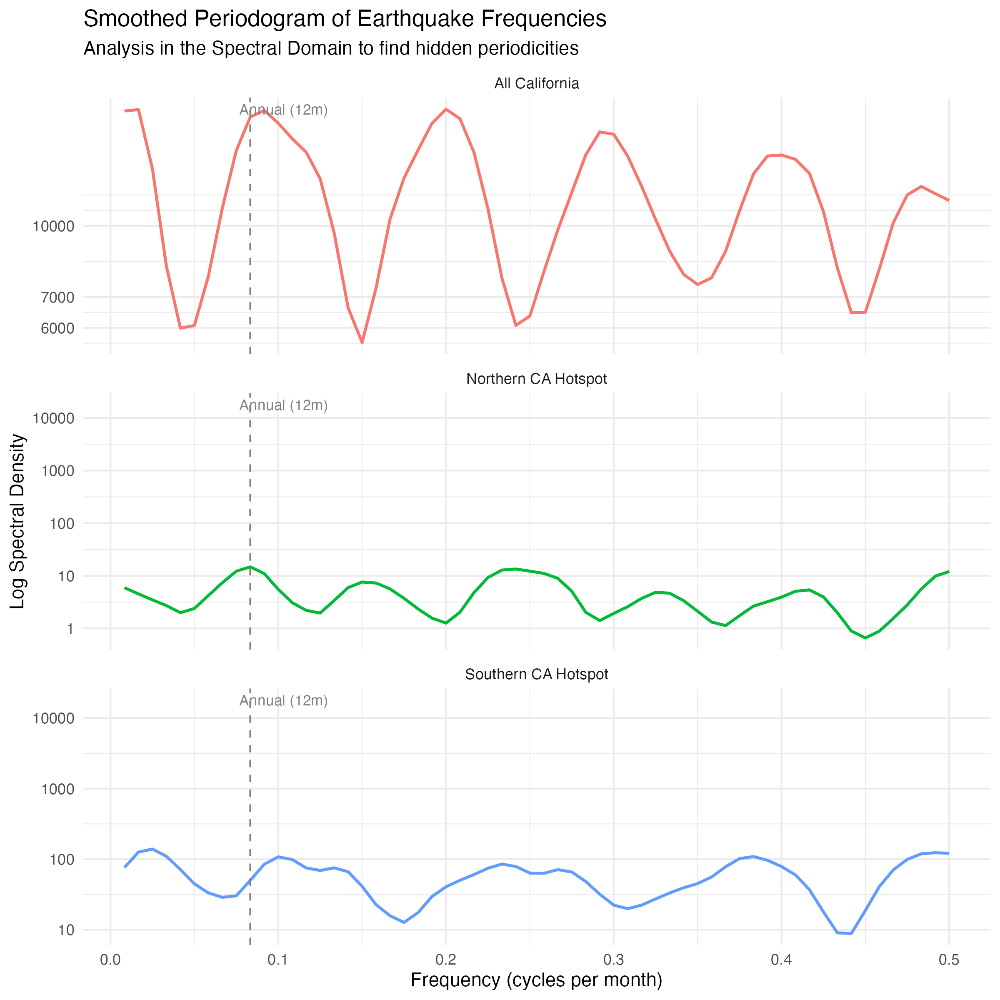
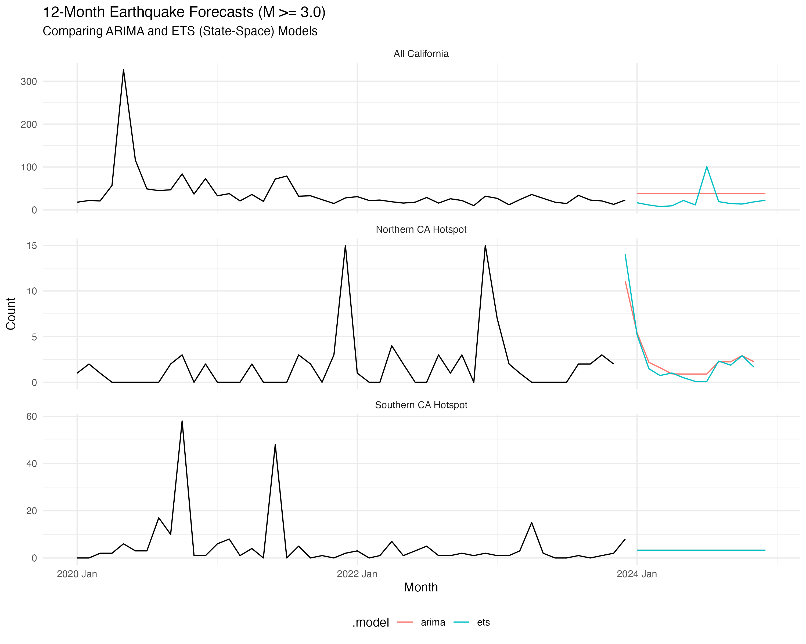
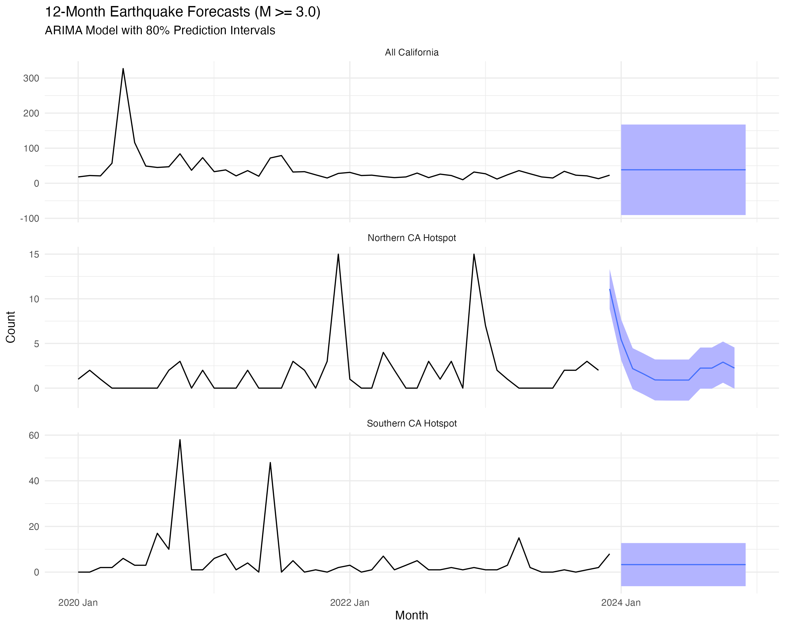

```{r setup, include=FALSE}
knitr::opts_chunk$set(echo = FALSE, warning = FALSE, message = FALSE)
```

## Key Findings

-   hotspot mapping identifies the Mendocino Triple Junction and Salton
    Sea/Brawley zone as key localized regions
-   STL suggests little meaningful seasonality
-   ACF supports clustering/autoregressive behavior
-   the smoothed periodogram does not support annual seasonality
-   ARIMA and ETS forecasts both show mean reversion, with much wider
    uncertainty for the northern hotspot than the southern one.

## Abstract

This report presents a comprehensive time series analysis of earthquake
frequencies in California from 2014 to 2024. Utilizing the U.S.
Geological Survey (USGS) Earthquake Catalog API, spatial data bounding
boxes were constructed to subset the overall California seismic activity
into distinct regional hotspots (Northern California Coast and the
Salton Sea area). We conduct exploratory spatial mapping, alongside a
rigorous comparison of Time Domain modeling (STL Decomposition,
Autocorrelation) against Spectral Domain analysis (Smoothed
Periodograms). Finally, we specify Auto-Regressive Integrated Moving
Average (ARIMA) and structural State-Space models (ETS) to forecast
baseline expected earthquake event counts for the following twelve
months. The response variable is the monthly number of earthquakes with
magnitude 3.0 or greater, modeled separately for all California, the
northern hotspot, and the southern hotspot.

------------------------------------------------------------------------

## 1. Introduction & Data Acquisition

Analyzing earthquake frequencies lies at the intersection of seismology
and statistical modeling. An inherent challenge is that tectonic stress
is an unobserved phenomenon (the "State"), whereas the earthquakes
themselves are the observed realizations of that stress (the
"Observation" or "Error").

Using R's `httr2` and `sf` libraries, data was obtained from the USGS
for all measured events with a magnitude ($M$) of 3.0 or greater. The
data was aggregated into monthly observation counts to normalize against
the varying sensitivity of regional seismographs.

### Regional Mapping (EDA)

Before modeling the counts over time, it is vital to model the counts
over space. Using Kernel Density Estimation, we identified two localized
zones of intense activity to isolate for localized statistical
forecasting alongside the aggregate state data.

```{r out.width="100%"}

```

-   **Northern California Hotspot:** The Mendocino Triple Junction.
-   **Southern California Hotspot:** The Salton Sea / Brawley Seismic
    Zone.

These zones were chosen because they both show a dense zone on the KDE
heatmap, and are geographically located in areas that are reasonable
representations of earthquakes in Northern California and Southern
California respectively.

------------------------------------------------------------------------

## 2. Time Domain Analysis

The Time Domain inherently looks backward, measuring current counts
against previous lags (autocorrelation) and decomposing the rolling
averages.

### STL Decomposition

```{r out.width="100%"}

```

The Seasonal-Trend decomposition using LOESS (STL) reveals drastic
differences across the spatial zones: \* **The Northern Hotspot**
exhibits a jagged, highly volatile trend with a massive noise
(remainder) component, driven by distinct earthquake swarms (e.g., late
2022). \* **The Southern Hotspot** is smoother, tracing a multi-year
slight decline in structural activity between 2016 and 2020. \* Across
all regions, the scaled "Seasonality" component is statistically
insignificant compared to the raw counts.

### Autocorrelation (ACF)

In seismological physics, *Omori's Law* states that major quakes trigger
cascading, decaying aftershocks. This physical law materializes
statistically as statistically significant positive Autocorrelation.

```{r out.width="100%"}

```

As demonstrated, the ACF spikes reliably for the first few lags
following high-rupture months across all three series, confirming the
clustering nature of tectonic events.

------------------------------------------------------------------------

## 3. Spectral Domain Analysis

To rigorously test for "Earthquake Seasons" (the debated theory that
events cluster around solar or lunar planetary cycles), we map the data
from the Time Domain into the Spectral Domain using a smoothed
periodogram.

```{r out.width="100%"}

```

If seismic activity correlated with the calendar year, we would expect a
pronounced peak in the Spectral Density curve at fundamental frequency
$1/12 \approx 0.0833$ (one cycle per 12 months). The periodograms above
suggest that the density at the annual mark is negligible.

Furthermore, the spectral density peaking near Frequency 0 and slowly
decaying is the textbook spectral fingerprint of an Autoregressive (AR)
process, aligning perfectly with the autocorrelation findings.

------------------------------------------------------------------------

## 4. Modeling & Forecasting

To forecast the upcoming 12 months, we fitted two distinct models
minimizing the AICc information criterion:

1.  **ARIMA (Auto-Regressive Integrated Moving Average):** Leveraging
    the strong serial autocorrelation.
2.  **ETS (Exponential Smoothing / State-Space):** Treating the
    underlying tectonic stress as an unobserved state component.

```{r out.width="100%"}

```

Both models correctly anticipate the "mean-reverting" nature of
earthquakes. After significant spikes, the models drag the expected
values back down to the historical base rate. Due to the high variance
of the Northern CA cluster sequences, prediction intervals are
substantially wider than in the more predictable Southern CA region.

Below are the 80% forecast bands for the ARIMA model.

```{r out.width="100%"}

```

------------------------------------------------------------------------

## Limitations

Earthquake counts are only one summary of seismic activity. While
ARIMA/ETS are useful baseline models, they do not capture the physical
mechanisms of tectonic plate movement. Furthermore, data was aggregated
monthly which may smooth short-term dynamics. Lastly, it may be more
appropriate to fit count data using a Poisson or negative-binomial
model.

------------------------------------------------------------------------

## Conclusion

This project demonstrates the power of fusing Geographic Information
Systems (GIS) with advanced Time Series techniques. After mapping the
raw events, subsetting the data spatially, and deploying models across
both the Time and Spectral domains, we find little evidence for calendar
seasonality while accurately modeling the autoregressive reality of
earthquake cluster sequences.

------------------------------------------------------------------------

## Appendix: R Code Repository

The R code for this project is entirely reproducible and modularized
into four main scripts: 1. `download_data.R` (API pulls & `sf` object
creation) 2. `generate_maps.R` (KDE spatial heatmaps using `ggplot2`) 3.
`time_domain_analysis.R` (STL, ACF modeling using `fpp3`) 4.
`spectral_analysis.R` (Smoothed Periodograms) 5.
`modeling_and_forecasting.R` (ARIMA, State-Space forecasting)
